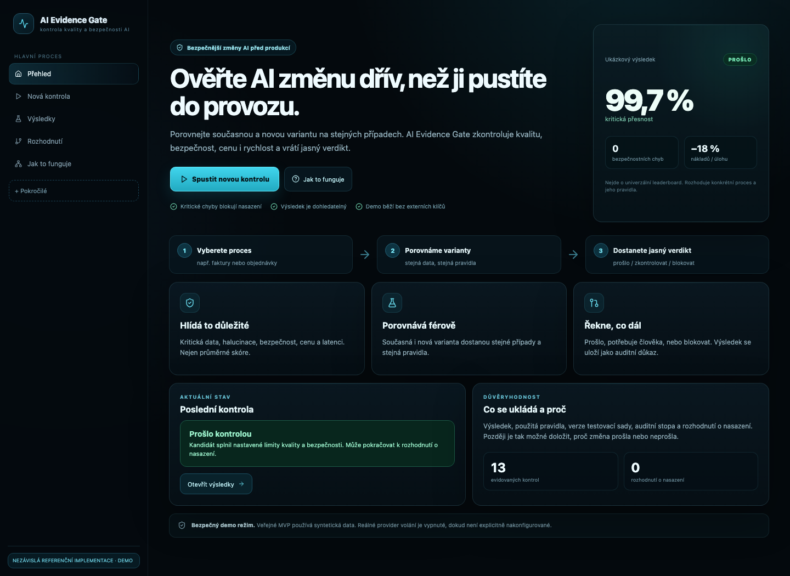
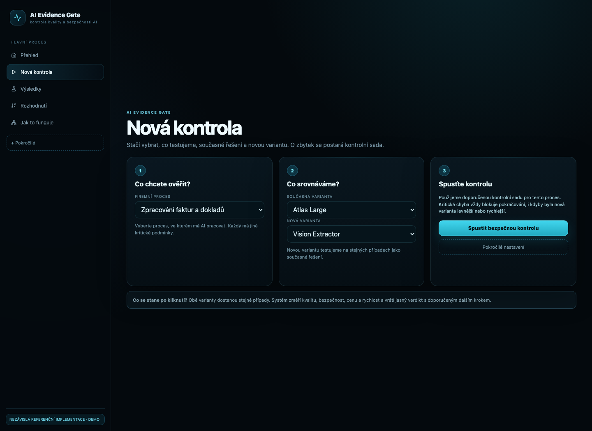

# AI Evidence Gate

### Ověřte AI změnu dřív, než ji pustíte do provozu.

**Evidence-first evaluation & release control plane for AI systems.**

AI Evidence Gate porovnává současnou a novou AI variantu na stejných případech, změří kvalitu, bezpečnost, cenu a rychlost a vrátí srozumitelný verdikt před nasazením.

> **Princip:** novější, rychlejší ani levnější model není automaticky lepší pro konkrétní firemní proces. Kritická chyba se nesmí schovat za dobrý průměr.



## Proč to existuje

Při změně modelu, promptu nebo agentního workflow potřebujeme odpovědět na jednoduchou otázku:

**Je nová varianta pro tento konkrétní proces prokazatelně lepší a dost bezpečná?**

AI Evidence Gate místo univerzálního leaderboardu používá use-case evidence a explicitní pravidla.

```text
současná varianta ─┐
                   ├─ stejné testovací případy → kvalita / bezpečnost / cena / rychlost
nová varianta ─────┘                                      ↓
                                            PROŠLO / KONTROLA / BLOCK
```
## Jak vypadá běžný uživatelský tok

1. **Vyberete proces** – faktury, schůzky, směny nebo objednávky.
2. **Porovnáte současnou a novou variantu** – obě dostanou stejná data a stejná pravidla.
3. **Dostanete verdikt** – prošlo, potřebuje člověka, nebo nenasazovat.
4. **Vytvoříte rozhodnutí o nasazení** – výsledek se uloží jako dohledatelný auditní záznam.



### Co produkt hlídá

- kritickou přesnost a správnost důležitých polí
- dodržení očekávaného formátu / schématu
- halucinace a vymyšlené údaje
- bezpečnostní selhání a nebezpečné automatické akce
- cenu za úlohu a změnu nákladů
- latenci a provozní dopad
- regresní chyby, které se mají příště testovat znovu

**`UNKNOWN ≠ PASS`** a hard-gate security failure nemůže zachránit levnější cena ani hezké průměrné skóre.
## Kde AI Evidence Gate zapadá ve firemním AI lifecycle

AI Evidence Gate není náhrada za AI analýzu, školení ani samotnou automatizaci. Je to kontrolní vrstva mezi vytvořeným AI workflow a jeho bezpečným dlouhodobým provozem.

```text
AI analýza → školení / adopce → automatizace → [ AI EVIDENCE GATE ] → provoz a rozvoj
                                               ↑                         │
                                               └──── každá další změna ──┘
```

Před prvním nasazením a potom při změně modelu, promptu, providera nebo agentního workflow se znovu přehrají stejné důkazní scénáře. Teprve výsledek `PASS / REVIEW / BLOCK` dává podklad pro release rozhodnutí.

To je záměrně obecný lifecycle pattern. Repo zároveň obsahuje samostatné nezávislé mapování na veřejně popsané use-cases Coalbrainu v [`docs/COALBRAIN_FIT.md`](docs/COALBRAIN_FIT.md); nejde o tvrzení o jejich interní architektuře ani o afiliaci.

## Architektura

```text
Model / agent candidate
        ↓
Versioned dataset + replay
        ↓
Graders + security checks
        ↓
Quality / latency / cost / safety evidence
        ↓
Release policy
        ↓
PASS / REVIEW / BLOCK
        ↓
PROMOTE / HOLD / BLOCK / UNKNOWN
        ↓
Persistent audit + regression feedback
```

### Stack

- **Frontend:** React + TypeScript + Vite
- **API:** FastAPI
- **Persistence:** PostgreSQL, SQLite fallback pro lokální scénáře
- **Runtime:** Docker Compose
- **Browser E2E:** Playwright
- **CI:** GitHub Actions workflow je součástí repozitáře

UI je záměrně **simple by default, evidence underneath**: běžný uživatel vidí hlavní proces, technické registry a auditní nástroje jsou schované v režimu „Pokročilé“.
## Ověřený stav MVP

Aktuální verze byla lokálně ověřena proti běžícímu Docker stacku:

- frontend production build: **PASS**
- API readiness: **PASS**
- český základní user journey: **5/5 Playwright E2E PASS**
- enterprise PROMOTE / BLOCK flow a persistence byly ověřeny v předchozím release gate
- veřejné demo používá syntetická data a externí provider volání je ve výchozím stavu vypnuté

> Nejde o produkční bezpečnostní certifikaci. Jde o funkční Enterprise MVP / reference implementation s explicitně popsanými trust boundaries.

## Quick start

```bash
git clone https://github.com/eimyroot/AI-Evidence-Gate.git
cd AI-Evidence-Gate
docker compose up --build -d
curl -fsS http://localhost:5173/ready
```

Aplikace: `http://localhost:5173`

OpenAPI: `http://localhost:8000/docs`

### Browser E2E

```bash
cd frontend
npm install
npx playwright install chromium
npm run e2e
```
## Use-case fit

Reference implementation obsahuje scénáře pro:

- zpracování faktur a dokladů
- meeting intelligence
- plánování směn
- order / ERP agent workflow

Repo obsahuje také samostatné nezávislé mapování na veřejně popsané use-cases Coalbrainu v [`docs/COALBRAIN_FIT.md`](docs/COALBRAIN_FIT.md). Nejde o tvrzení, že Coalbrain tento produkt používá nebo s projektem spolupracuje.

## Enterprise boundary

Hotové jsou evidence, release decisions, auditní stopa, workspaces, policies, regression corpus, provider boundary a Docker/browser verification.

Před skutečným regulovaným nebo multi-tenant deploymentem by bylo potřeba doplnit zejména:

- OIDC / SSO + enforceable RBAC
- tenant isolation
- secrets manager / KMS
- klientský ingestion + PII redaction / retention
- OpenTelemetry + alerting
- backup / restore drills
- signed release attestations
- HA / SLO a reálné ERP/provider adaptéry

Podrobněji: [`docs/ENTERPRISE_MVP.md`](docs/ENTERPRISE_MVP.md) · [`docs/ARCHITECTURE.md`](docs/ARCHITECTURE.md) · [`docs/PRODUCT_TRUTH.md`](docs/PRODUCT_TRUTH.md)

---

**Independent portfolio project · reference implementation · no affiliation with Coalbrain or model providers.**
